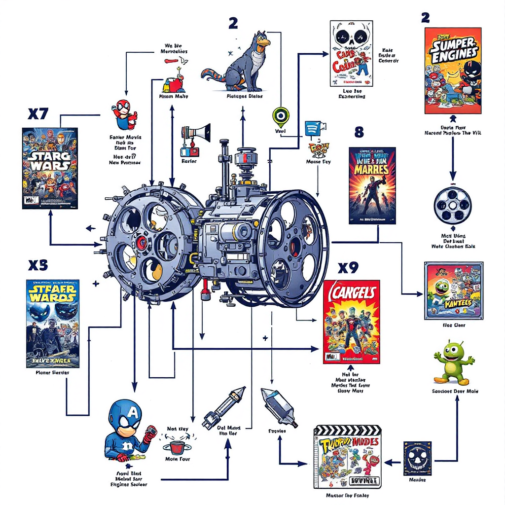
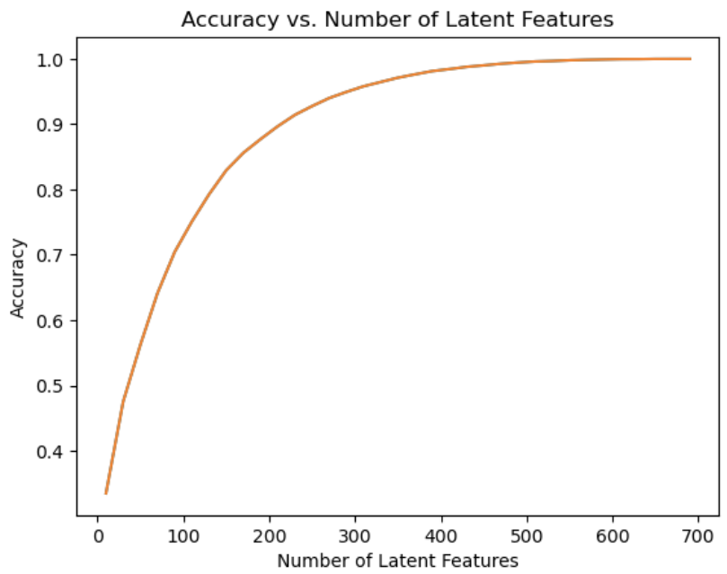

# Recommender Engine


###  **Overview:**

This project focuses on developing a recommendation system by analyzing user's interaction with articles  on the IBM Watson Studio platformform. Through a comprehensive approach, the analysis encompasses multiple recommendation techniques, including rank-based recommendations, user-user collaborative filtering, and matrix factorization. Beginning with exploratory data analysis to understand user behavior patterns, the project progresses through increasingly complex recommendation methodologies. While content-based recommendations are considered for future development, the core emphasis remains on leveraging user interaction data to generate accurate and relevant article suggestions. The ultimate goal is to enhance user engagement by connecting readers with articles that align with their interests, creating a more personalized and engaging experience.

### Prerequisites

1. Git
2. Python 3.7+ (3.11+ preferred)
3. VS Code Editor (or any other IDE)


The following modules are required: 
```
import pandas as pd
import numpy as np
import matplotlib.pyplot as plt
import project_tests as t
import pickle
import seaborn as sns
pd.set_option('display.max_colwidth', 800)
```
### Deployment
<ul>Reccomendations_with_IBM.ipynb: Jupyter Notebook containings most of the code with the exception of testing code.</ul>
<ul>Data: This folder containes the datasets used in the Jupyter Notebook.</ul>

Other files:
- reccomender_functions.py: example code previuoly developed.
- reccomender_template.py: example template previously developed.
- svd_tests.py: it contains some of the test functions implemented in the Jupyter Notebook.
- reccomender.py: it contains a template for a class for a similar use case.
- user_item_matrix.p: serialized object, which was saved earlier in the workflow.
- top_5.py: serialized object, which was saved earlier in the workflow.
- top_10.p: serialized object, which was saved earlier in the workflow.
- top_20.p: serialized object, which was saved earlier in the workflow.
- recommender_picture.png: picture file for the intro of README.
- output1.png: pciture file to show latent features exploration.


### Resources
- [Recommendation-Engine](https://www.ibm.com/think/topics/recommendation-engine/)
- [SVD](https://www.geeksforgeeks.org/singular-value-decomposition-svd/)
- [FunkSVD](https://towardsdatascience.com/funk-svd-hands-on-experience-on-starbucks-data-set-f3e0946da014/)
### Outputs
Below is a screenshot of `latent features` exploration.



### Acknowledgment
I would like to acknowledge to Stackoverflow, You.com for its generative AI models, and ChatGPT as instrumental aids in the development of this project.
